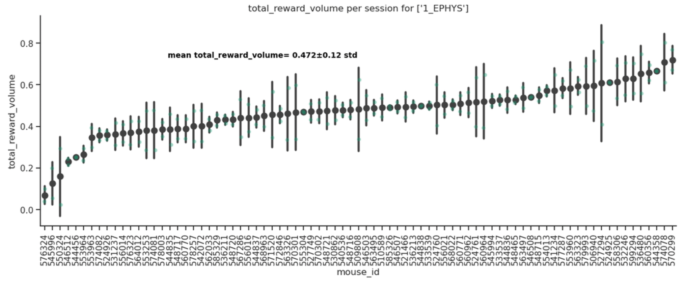
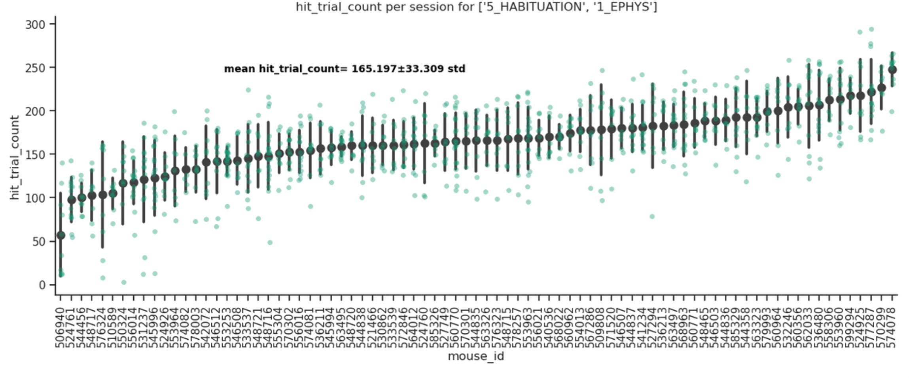
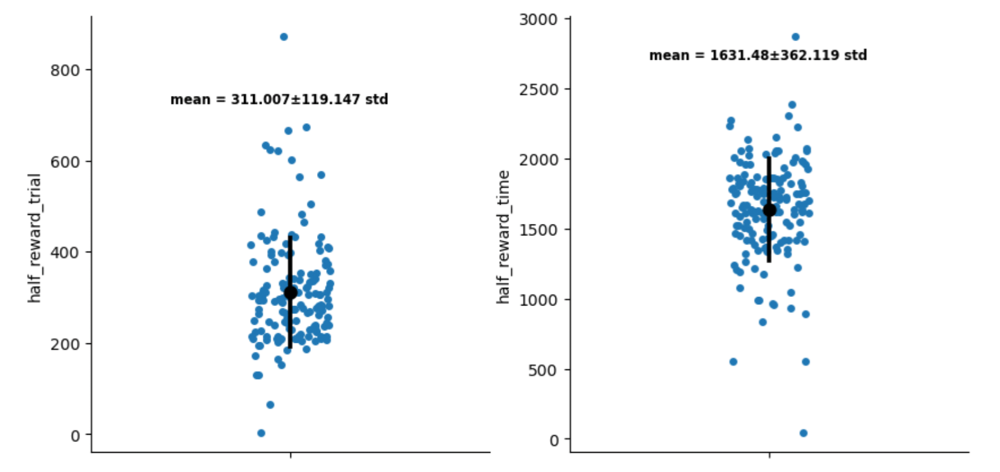

## Change detection task parameters

Our version of the change detection task (CDT) introduces two modifications:
*   2 CDT blocks within session separated by a break to allow injection
*  Each CDT block is further divided in two sections (short & long) in which the image changes are drawn from different distributions

#### Some parameters regarding these modifictions have to be optimized

1. Duration of the pre and post blocks
2. Duration of the short & long sections withon each CDT

## Duration of the pre and post blocks

The aim is to have similar performance/engagement between the two pre- post- injection blocks.
It is paramount that the mouse is not satiated after the 
first block, therefore not engaging in the task afterward. 

### Option 1
To ensure similar engagement we can look at the the mean reward amount or number 
of hit trials per session in the 
[visual-behavior-neuropixels dataset](https://portal.brain-map.org/circuits-behavior/visual-behavior-neuropixels)
and dynamically change the block duration contingent on the number of hit trials/rewards accumulated.

Training is structured in the following stages:

We compute the average reward per mouse during the last 2 stages of training:

or on recording days only:

We also compute the number of hit trials during the last 2 stages of training:

or on recording days only:

### Option 2

We can hardcode the duration of the blocks by looking at 
the mean time necessary to reach 50% of the total reward in each session. 

## Duration of the short & long sections withon each CDT

The aim here is to have the same number of hit trials in each section. We can expect the mice to 
collect more rewards in the section where image changes tend to happen earlier. We should adjust for this 
by reducing the duration of this section.